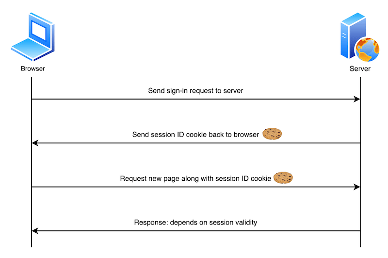

# Using HTTP cookies

- **cookie** also knows as a web cookie or browser cookie is a small piece of data a server sends to a user's web browser
  - browser may sotre cookies, create new cookies, modify exisitng ones, and send them back to the same server with later requests
  - cookies enable web applications to store limited amounts of data and remember state information
  - by default the HTTP protcol is `stateless`

## What cookies are used for

- typically the server will use the contents of HTTP cookies to determine whther different requests come from the same browser/user and then issue a personalized or generic response as appropriate
  - sign-in system:
    1. the user sends sign-in credentials
    2. if the credentials are correct, the server updates the UI to indicate that the user is signed in, and responds with a cookie containing a session ID that records their sign-in status on the browser
    3. at a later time, the user moves to a different page on the same site, the browser sends the cookie containing the session ID alown with the corresponding request to indicate that it still thinks the user is signed in
    4. the server checks the session ID and, if it is still valid, sends the user a personalized version of the new page. If it is not valid, the session ID is deleted and the user is shown a generic version of the page - access denied

()

- cookies are mainly used for three purposes:
  1. session management - sign-in status, shopping card contents
  2. personalization - user preferences
  3. tracking - recording and analyzing user behavior

### Data storage

- browsers are generally limited to a maximum number of cookies per domain, max isze per cookie - 4KB
  - storage API can store larger amounts of data
- cookies are sent with every request, so they can worsen performance (especially if we have a lot of cookies set)

### Creating and removing cookie

#### Create

```js
HTTP/2.0 200 OK
Content-Type: text/html
Set-Cookie: yummy_cookie=chocolate
Set-Cookie: tasty_cookie=strawberry

[page content]
```

#### Removal: defining the lifetime of a cookie

- **permanent cookies**

  - `Expires` and `Max-Age` attribute
    - `Expires` has been available for longer then `Max-Age`, however `Max-Age` is less error-prone, and takes precedence when both are set
      - **the rationale behind thius is that when we set and `Expires` date and time, they are relative to the client the cookie is being set on - if the server is set to a different time, this could cause errors**

- **session cookies**
  - without attributes, deleted when the current session ends
    - the browser defines when the "current session" ends, and some browsers use session restoring when restarting - can cause session cookies to last indefinitely
      - **if web site authenticates users, it should regenerate and resend session cookies, even ones that already exist, whenever a user authenticates. This approach helps prevent `session fixation attacks`, where a third-party can reuse a user's session**

### Security

- when information is stored in cookies, by default all cookie values are visible to, and can be changed

#### Block access to cookies

- ensure that cookies are sent securely and are not accessed by uninteded parties or scripts in on of two ways: `Secure` and `HttpOnly` attribute
  - cookie with the `Secure` attribute is only sent to the server with an ecnrypted request over the HTTPS protocol
    - never sent with unsecured HTTP expect on localhost, which means `man-in-the-middle` attackers can't access it easily
  - cookie with the `HttpOnly` attribute can't be accessed by JavaScript (e.g. using **Document.cookie**); it can be only accessed when it reaches the server

#### Define where cookies are sent

- the `Domain` and `Path` attributes define the scope of a cookie

  - `Domain` attribute specifies which server can receive a cookie

  ```js
  Set-Cookie: id=a3fWa; Expires=Thu, 21 Oct 2021 07:28:00 GMT; Secure; HttpOnly;
  Domain=mozilla.org
  ```

  - the `Path` attribute indicates a URL path that must exist in the requested URL in order to send the `Cookie` header

  ```js
  Set-Cookie: id=a3fWa; Expires=Thu, 21 Oct 2021 07:28:00 GMT; Secure; HttpOnly; Path=/docs
  ```

#### Controlling Third-Party Cookies with SameSite

the `SameSite` attribute controls when cookies are sent with cross-site requests, enhancing privacy and mitigating cross-site request forgery (CSRF) risks. It supports three values:

- **Strict**: Cookies are only sent with requests from the same origin.
- **Lax**: Cookies are sent with same-origin requests and top-level navigations.
- **None**: Cookies are sent with all requests but require the `Secure` attribute.

#### Cookie Prefixes

- `__Host-`: Domain-locked, secure cookies with a path of `/`.
- `__Secure-`: Secure cookies tied to their origin.

### Privacy and Tracking

- third-party cookies can enable tracking across sites, which raises privacy concerns.
- many browsers block third-party cookies by default due to user preferences.
- developers should minimize reliance on third-party cookies as browser restrictions increase.

### Cookie Regulations

key regulations include:

- **GDPR** (EU)
- **ePrivacy Directive** (EU)
- **California Consumer Privacy Act** (CCPA)

these laws require transparency, user consent, and cookie opt-out options. Developers must comply with applicable regulations and may use cookie banners for compliance.
